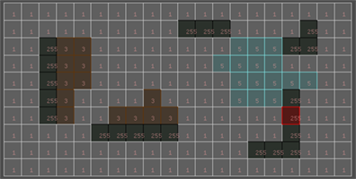
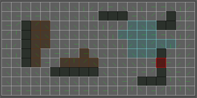

<h1 align="center"> Flow Field Pathfinding </h1>

<b>Generate flow field to use in steering large crowds of agents</b>

## Table of Contents
- [Introduction](#Introduction)
- [Explanation](#Explanation)
   * [Types-of-fields](#types-of-fields)
     * [Cost-field](#cost-field)
     * [Integration-field](#integration-field)
     * [Flow-field](#flow-field)
  * [Simple-steering](#simple-steering)
  * [Flocking](#flocking)
     * [Seperation](#seperation) 
     * [Cohesion](#cohesion) 
     * [Velocity-match](#velocity-match) 
     * [Wander](#wander) 
     * [Obstacle-evasion](#obstacle-evasion) 
- [Result](#result)
- [Conclusion](#conclusion)
- [Credits](#credits)
- [License](#license)

# Introduction

In modern game development pathfinding alorithms like A*, D*, Dijkstra,... are often used for finding realistic and optimal paths in levels. These types of algorithms provide    very good results, but are very costly when used for a large amount of different agents. Flow fields provide a nice middle ground between efficience and quality. They can be   used to generate pathways for many agents to use at a time. If we combine this with flocking, we can simulate realistic crowds without curdening the CPU with recalculating the   path for every agent. 

# Explanation

## Types-of-fields

 

### Cost-field

This field contains the <b>go-to</b> costs of each node. These costs are dependant on the type of terrain that is on the node.
  The cost is an 8-bit integer between [1-255], with [1-254] being traversible terrain and [255] not traversible. 

  
  
  
  
 
 
 
 ### Integration-field

The integration field assigns new costs to each cell. The target cell always has a cost of 0. Starting from this cell, we check every other cell. For every cell, we check the  neighbors and remember the lowest neighboring score. We add this score with the cost field score of the current cell and this is our final cost.

  
  
 
 
 
 
### Flow-field

 The flow field (also known as direction map) contains all the direction that should be followed by the agents. This is calculated by checking all neighbors of every cell and  calculating the direction from the current cell to the neighbor with the lowest integration cost.

  
  

## Simple-steering

  
  

Agent steering is rather easy to implement. In the steering behavior we check in which cell the agent resides. We set the steering velocity to the direction of the cell and scale it to the agent speed. 

  
  
  

## Flocking

To make the steering look more natural, we can add flocking to the agents. This way the agents react to each other. The flocking behavior consists of multiple steering behaviors.

### Seperation

The agents move away from neighboring agents. 

### Cohesion

The agents move towards neighboring agents. 

### Velocity-match

The agents match their velocity to neighboring agents’ velocity. 

### Wander

The agents randomly wander the world. 

### Obstacle-evasion

The agents try to move away from obstacles, to prevent collision. 

# Result

With everything combined, we have a cheap and efficient alternative to using cost-heavy pathfinding like A* on every agent. This is how the result looks.

  

  
# Conclusion

This is a rather basic implementation of flow field pathfinding, but the possibilities are endless. Flow fields are already used in different types of simulation (originally fluid simulations, hence <b>flow</b> field) and in generative art. 
The generating of the flow field can also be customized. We can use different types of simplifield pathfinding algorithms to generate the maps and can use flags in the integration and flow field (very useful for games) 

# Credits
- Framework provide by DAE Kortrijk
- Framework authors:  Matthieu Delaere, Thomas Goussaert, Koen Samyn, Andries Geens and Yosha Vandaele
- Emerson, E. (2013). Crowd Pathfinding and Steering Using Flow Field Tiles. In S. Rabin (Ed.), Game AI Pro: Collected Wisdom of Game AI Professionals (pp. 307-316). Boca Raton: CRC Press.
- Li, H and Hamilton, H. (2015), Crowds - Flow Fields, URegina, accessed 05/01/2022, <http://www2.cs.uregina.ca/~anima/408/Notes/Crowds/FlowField.pdf>
- Treuille, A , Cooper, S and Popovic´, Z.  (n.a.), Continuum Crowds, Washington.edu, accessed 05/01/2022, < http://grail.cs.washington.edu/projects/crowd-flows/continuum-crowds.pdf>
- Turbo Makes Games. (2020), How flow field pathfinding works – flow fields in unity ep.1, youtube, accessed 05/01/2022, < https://www.youtube.com/watch?v=zr6ObNVgytk>

## License
[MIT](https://tldrlegal.com/license/mit-license)
